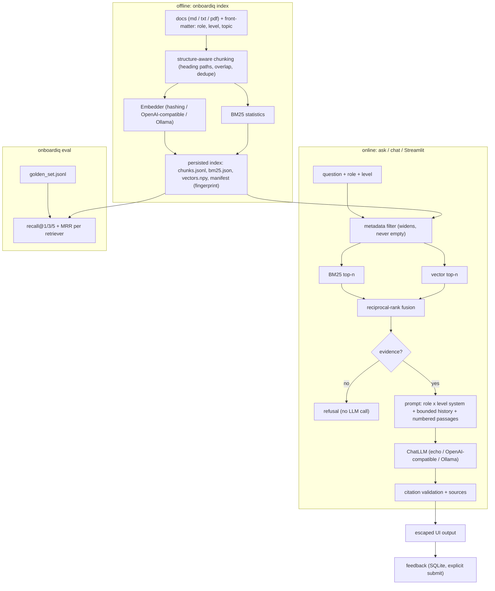

# onboardiq

A role- and seniority-aware onboarding assistant: it answers a new team member's questions from the team's own documents, cites the passages it used, and adapts its depth to a Junior, Mid-level or Senior Data Scientist, Data Engineer or Data Analyst.

[](https://github.com/KrishnaAnnavaram/onboardiq/actions/workflows/ci.yml)

> **Status:** working MVP. Ingestion, persisted hybrid index, grounded generation with citations, feedback capture, a CLI, a Streamlit UI and a retrieval evaluation all run end to end, fully offline by default. Re-ranking and answer-faithfulness scoring are on the roadmap.

## Features

- **Index once, query many times.** An ingestion step chunks the documents, embeds them once and persists BM25 statistics and vectors. Later runs reuse the index unless the documents, chunking settings, tokenizer or embedder changed.
- **Real hybrid retrieval.** BM25 and vector search each rank candidates, and **reciprocal-rank fusion** merges the two lists, so neither retriever can hide the other.
- **Metadata filtering by role and level.** Documents declare their audience in front-matter (`role`, `level`, `topic`). The filter widens step by step (role + level, then role, then everything) and never returns an empty candidate set.
- **Grounded answers with citations.** The retrieved passages are exactly what the model sees, numbered `[1]..[k]`. Citations are validated against those passages, and every answer lists its sources. When retrieval finds no supporting evidence, the assistant refuses without calling the model.
- **Answers adapted to the reader.** A role × level system prompt changes focus (pipelines vs. modelling vs. metrics) and depth (step by step vs. trade-offs vs. decisions only).
- **Explicit feedback.** Helpful / not-helpful ratings and comments are stored in SQLite only when the user submits them; resubmitting updates the same row. Export to CSV from the CLI.
- **Safe rendering.** Questions and answers are HTML-escaped and the UI never enables raw HTML.
- **Pluggable providers.** Any OpenAI-compatible API or a local Ollama server for chat and embeddings, using only the standard library for HTTP. Deterministic fakes (a hashing embedder and an extractive "echo" LLM) make it run offline and keep the tests free of network calls and API keys.
- **Retrieval evaluation.** recall@k and MRR for BM25, vector and hybrid retrieval on a hand-written golden question set, run in CI.

## Architecture



## Quickstart

```bash
python -m venv .venv
. .venv/Scripts/activate          # Windows; use .venv/bin/activate on Linux/macOS
pip install -e ".[dev]"           # core + tests; add ",ui" for Streamlit and ",pdf" for PDF input
pytest                            # offline, no API keys needed

cp .env.example .env              # optional: choose providers (see Configuration)
onboardiq index                   # chunk + embed sample_docs/ once, persist to .index/
onboardiq ask "Who approves production write access?" --role data_engineer --level junior
onboardiq chat --role data_scientist --level senior    # '+' / '-' rates the last answer
onboardiq eval                    # retrieval recall@k / MRR on eval/golden_set.jsonl
onboardiq ui                      # Streamlit app (needs: pip install -e ".[ui]")
onboardiq feedback export --out feedback_export.csv
```

With no configuration the offline providers are used: the hashing embedder and the extractive echo model, which quotes the best-matching sentence of the top passages and cites it. To use a real model, for example:

```bash
ONBOARDIQ_LLM_PROVIDER=ollama ONBOARDIQ_LLM_MODEL=llama3.1 \
ONBOARDIQ_EMBED_PROVIDER=ollama ONBOARDIQ_EMBED_MODEL=nomic-embed-text onboardiq index
```

Point `ONBOARDIQ_DOCS_DIR` at your own folder of Markdown files with front-matter like the files in [`sample_docs/`](sample_docs/).

## Configuration

All settings are environment variables (a `.env` file in the working directory is read too; real environment variables win).

| Variable | Default | Meaning |
|---|---|---|
| `ONBOARDIQ_DOCS_DIR` | `sample_docs` | Folder of `.md` / `.txt` / `.pdf` documents |
| `ONBOARDIQ_INDEX_DIR` | `.index` | Where the persisted index is written |
| `ONBOARDIQ_FEEDBACK_DB` | `.index/feedback.sqlite` | SQLite file for feedback |
| `ONBOARDIQ_LLM_PROVIDER` | `echo` | `echo` (offline), `openai` (any OpenAI-compatible API) or `ollama` |
| `ONBOARDIQ_LLM_MODEL` | `gpt-4o-mini` | Chat model name for the chosen provider |
| `ONBOARDIQ_EMBED_PROVIDER` | `hashing` | `hashing` (offline), `openai` or `ollama` |
| `ONBOARDIQ_EMBED_MODEL` | `text-embedding-3-small` | Embedding model name |
| `ONBOARDIQ_TEMPERATURE` | `0.1` | Sampling temperature |
| `ONBOARDIQ_TOP_K` | `4` | Passages given to the model |
| `ONBOARDIQ_CANDIDATE_K` | `20` | Candidates per retriever before fusion |
| `ONBOARDIQ_CHUNK_SIZE` | `700` | Maximum chunk length in characters |
| `ONBOARDIQ_CHUNK_OVERLAP` | `100` | Characters carried over between chunks of a section |
| `ONBOARDIQ_HISTORY_TURNS` | `3` | Previous exchanges kept in the prompt |
| `ONBOARDIQ_MIN_SIMILARITY` | `0.15` | Cosine floor used by the "no evidence" check when BM25 finds nothing |
| `OPENAI_API_KEY` | | Key for the OpenAI-compatible endpoint |
| `OPENAI_BASE_URL` | `https://api.openai.com/v1` | Base URL of the OpenAI-compatible endpoint |
| `OLLAMA_HOST` | `http://localhost:11434` | Ollama server |

## Project structure

```
src/onboardiq/
  config.py               Settings from environment variables / .env
  types.py                Document, Chunk, Hit, Citation, Answer; role and level tags
  ingest/loaders.py       folder loader, front-matter parser, optional PDF reader
  ingest/chunking.py      heading-aware chunking with overlap and duplicate removal
  index/store.py          persisted index (chunks, BM25, vectors, manifest) and build_or_load cache
  retrieve/text.py        whole-word tokenizer with light plural folding
  retrieve/bm25.py        Okapi BM25 with serialisable state
  retrieve/vector.py      cosine search over the embedding matrix
  retrieve/fusion.py      reciprocal-rank fusion
  retrieve/filters.py     role / level metadata filter with graceful widening
  retrieve/hybrid.py      filter -> BM25 + vector -> RRF; evidence check
  providers/              Embedder and ChatLLM interfaces, fakes, OpenAI-compatible and Ollama clients
  generate/prompts.py     role x level system prompt, numbered context, bounded history
  generate/citations.py   marker extraction, validation and source formatting
  generate/answer.py      retrieve -> refuse or prompt -> LLM -> citations
  feedback/store.py       SQLite feedback with explicit submit and CSV export
  eval/                   recall@k, MRR and the golden-set runner
  service.py              Assistant facade used by the CLI and the UI
  render.py               HTML-escaped rendering
  cli.py                  `onboardiq` command
  app.py                  Streamlit UI
sample_docs/              short synthetic onboarding guides with front-matter
eval/golden_set.jsonl     30 hand-written questions with their relevant sections
tests/                    pytest suite (offline)
```

## How it works

1. **Ingestion.** Each file's front-matter becomes metadata. The body is split at Markdown headings, so a chunk never crosses sections and keeps its heading path (`pipelines.md > Building and Running Pipelines > Backfills`). Sections are packed paragraph by paragraph up to `CHUNK_SIZE`, with sentence- and then word-level splitting for very long paragraphs, and `CHUNK_OVERLAP` characters of carried context. Duplicate chunks (ignoring case, punctuation and spacing) are dropped.
2. **Indexing.** Chunks (heading + text) are embedded once. BM25 term statistics, the vectors and the chunks are saved with a manifest whose fingerprint covers the document bytes, the chunking settings, the tokenizer version and the embedder name.
3. **Retrieval.** The metadata filter selects chunks for the reader's role and level (chunks tagged `all` are always eligible). BM25 and cosine search each return their top candidates within that set, and reciprocal-rank fusion (`score = Σ 1 / (60 + rank)`) merges them.
4. **Generation.** If no passage shares a query term and none is semantically close, the assistant refuses. Otherwise one prompt is built: a role × level system message, the last few exchanges, and the numbered passages. The model's `[n]` markers are checked against the passages actually shown; invalid markers are removed and, if nothing valid was cited, all shown passages are listed as sources.
5. **Feedback.** The UI shows a form per answer with no preselected rating. Submitting writes or updates one row keyed by the answer id, including the cited chunk ids.

## Evaluation

`onboardiq eval` runs the 30 hand-written questions in [`eval/golden_set.jsonl`](eval/golden_set.jsonl) (each labelled with the file and section that answers it) against each retriever, with and without the role / level filter. Results with the offline hashing embedder on the sample documents:

| Setting | Retriever | recall@1 | recall@3 | recall@5 | MRR |
|---|---|---:|---:|---:|---:|
| role/level filter | BM25 | 0.967 | 1.000 | 1.000 | 0.983 |
| role/level filter | vector | 0.933 | 1.000 | 1.000 | 0.967 |
| role/level filter | **hybrid (RRF)** | 0.967 | 1.000 | 1.000 | 0.983 |
| whole corpus | BM25 | 0.967 | 1.000 | 1.000 | 0.983 |
| whole corpus | vector | 0.867 | 1.000 | 1.000 | 0.933 |
| whole corpus | **hybrid (RRF)** | 1.000 | 1.000 | 1.000 | 1.000 |

The corpus is tiny (36 chunks) and the hashing embedder is lexical, so these numbers mostly show that the harness and fusion work; they are not a benchmark. Rerun the evaluation with a real embedding model and your own documents and questions. CI fails if hybrid recall@5 drops below 0.9 or MRR below 0.8 on the sample set.

## Testing

```bash
pip install -e ".[dev]"
pytest -q
```

The suite runs offline with the fake providers. Besides unit tests for chunking, BM25, fusion, filters, citations and metrics, there is a regression test for each problem found in the earlier prototype:

| Earlier problem | Fix | Test |
|---|---|---|
| Answer was generated from an agent's reply, not from retrieved documents | One retrieval, one LLM call, retrieved passages placed verbatim in the prompt and cited | `test_generation.py` |
| "Hybrid" search was BM25 with FAISS as a fallback | Reciprocal-rank fusion of both rankings | `test_fusion.py` |
| Documents re-read and re-embedded on every message | Persisted index with fingerprint cache; queries embed only the question | `test_index_cache.py` |
| Substring keyword filter; crash when nothing matched | Front-matter metadata, whole-word tokens, filter that widens instead of emptying | `test_bm25_and_filters.py` |
| Feedback always recorded as "Yes" | No default; explicit submit; upsert in SQLite | `test_feedback.py`, `test_app.py` |
| HTML injection through `unsafe_allow_html` | Escaped rendering; raw HTML never enabled | `test_citations_and_render.py`, `test_app.py` |
| No evaluation | Golden set, recall@k, MRR, CI floor | `test_eval.py` |
| Duplicated components, unbounded chat history | One provider interface per capability; bounded history window | `test_generation.py`, `test_config_and_providers.py` |
| Near-duplicate documents without metadata | Front-matter on every document; duplicate-chunk removal | `test_chunking.py` |

`test_app.py` drives the Streamlit UI headlessly and is skipped when Streamlit is not installed.

## Roadmap

- [x] **M1:** ingestion CLI with structure-aware chunking and a persisted, fingerprinted index
- [x] **M2:** BM25 + vector retrieval fused with RRF, role / level metadata filters
- [x] **M3:** grounded generator with validated citations, refusal on missing evidence, role × level prompts
- [x] **M4:** golden question set with recall@k / MRR, enforced in CI
- [x] **M5:** Streamlit UI with escaped output and explicit SQLite feedback
- [ ] Cross-encoder re-ranking of the fused candidates
- [ ] Answer faithfulness and relevance scoring (LLM-as-judge) next to retrieval metrics
- [ ] Optional query rewriting for follow-up questions that depend on chat history
- [ ] Larger golden set per role and level, and a report that compares embedding models
- [ ] Incremental re-indexing of changed files only

## Limitations

- The offline echo model only quotes sentences; it is for demos and tests, not for real answers.
- The hashing embedder captures word and character overlap, not meaning. Use a real embedding model for paraphrased questions.
- The vector search is exact (a matrix product), which is fine for thousands of chunks; very large corpora would need an ANN index.
- PDF text is read page by page without layout analysis, and PDFs carry no role / level metadata, so they are visible to everyone.
- The role and level vocabulary (three data roles, three levels) is fixed in `types.py`.
- The refusal check is a simple lexical / cosine threshold, not a trained answerability model.

## License

MIT © 2026 Krishna Annavaram. See [LICENSE](LICENSE).
